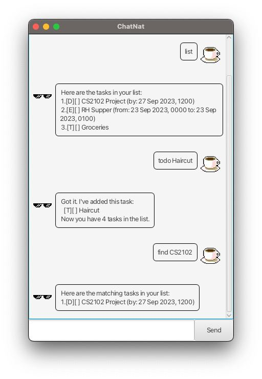

# ChatNat User Guide

**ChatNat** is the second-brain tool you need to transform the way you manage
tasks.



## Features

### Adding a to-do: `todo`

Adds a todo task to the task list.

Format: `todo DESCRIPTION`

Examples:

- `todo Haircut`
- `todo Groceries`

```
> todo Haircut

Got it. I've added this task:
  [T][] Haircut
Now you have 1 task in the list.
```

### Adding a deadline: `deadline`

Adds a deadline task to the task list.

Format: `deadline DESCRIPTION /by DATE [TIME]`

- Time has to be in 24-hour format. (e.g. `1200`).
- Indicating time is optional. Time is `0000` if not indicated.
- Use `FullYear-Month-Date` or `Date/Month/FullYear` for DATE.
- Indicating the `/by` with a valid date is compulsory.

Examples:

- `deadline CS2103T Quiz /by 2023-09-23 1200`
- `deadline CS2105 Assignment /by 24/9/2023`

```
> deadline CS2103T Quiz /by 2023-09-23 1200

Got it. I've added this task:
  [D][] CS2103T Quiz (by: 23 Sep 2023, 1200)
Now you have 2 tasks in the list.
```

### Adding an event: `event`

Adds a event task to the task list.

Format: `event DESCRIPTION /from DATE [TIME] /to DATE [TIME]`

- Time has to be in 24-hour format. (e.g. `1200`).
- Indicating time is optional. Time is `0000` if not indicated.
- Use `FullYear-Month-Date` or `Date/Month/FullYear` for DATE.
- Indicating the `/by` with a valid date is compulsory.

Examples:

- `event CS2103T meeting /from 2023-09-23 /to 2023-09-23 0100`

```
> event CS2103T meeting /from 2023-09-23 /to 2023-09-23 0100

Got it. I've added this task:
  [E][] CS2103T meeting (from: 23 Sep 2023, 0000 to: 23 Sep 2023, 0100)
Now you have 3 tasks in the list.
```

### Listing all tasks: `list`

Lists all the tasks.

Format: `list`

Examples:

```
> list

Here are the tasks in your list:
1.[T][] Haircut
2.[D][] CS2103T Quiz (by: 23 Sep 2023, 1200)
3.[E][] CS2103T meeting (from: 23 Sep 2023, 0000 to: 23 Sep 2023, 0100)
```

- Tasks appear in the order they were added.

### Finding tasks: `find`

Finds matching tasks based on search input.

Format: `find KEYWORDS`

- The keywords are **case-sensitive**.

Examples:

- `find CS2103T`
- `find Raffles Hall`

```
> find CS2103T

Here are the matching tasks in your list:
1.[D][] CS2103T Quiz (by: 23 Sep 2023, 1200)
2.[E][] CS2103T meeting (from: 23 Sep 2023, 0000 to: 23 Sep 2023, 0100)
```

- Tasks appear in the order they were added.

### Deleting a task: `delete`

Deletes the specified task.

Format: `delete INDEX`

- Deletes the task at the specified index.
- The index refers to the index number shown in the full tasks list after
  entering the `list` command.
- The index must be a positive integer 1, 2, 3, ….
- The minimum index is 1, and maximum index is the number of tasks.

Examples:

- `delete 1`
- `delete 2`

```
> delete 1

Noted. I've removed this task:
  [T][] Haircut
Now you have 2 tasks in the list.
```

- **WARNING: This action is irreversible.**

### Marking a task: `mark`

Marks a specified task.

Format: `mark INDEX`

- Marks the task at the specified index.
- The index refers to the index number shown in the full tasks list after
  entering the `list` command.
- The index must be a positive integer 1, 2, 3, ….
- The minimum index is 1, and maximum index is the number of tasks.

Examples:

- `mark 1`
- `mark 2`

```
> mark 1

Nice! I've marked this task as done:
  [D][X] CS2103T Quiz (by: 23 Sep 2023, 1200)
```

### Unmarking a task: `unmark`

Unmarks a specified task.

Format: `unmark INDEX`

- Unmarks the task at the specified index.
- The index refers to the index number shown in the full tasks list after
  entering the `list` command.
- The index must be a positive integer 1, 2, 3, ….
- The minimum index is 1, and maximum index is the number of tasks.

Examples:

- `unmark 1`
- `unmark 2`

```
> unmark 1

OK, I've marked this task as not done yet:
  [D][] CS2103T Quiz (by: 23 Sep 2023, 1200)
```

### Exiting ChatNat: `bye`

Exits the application.

Format: `bye`
